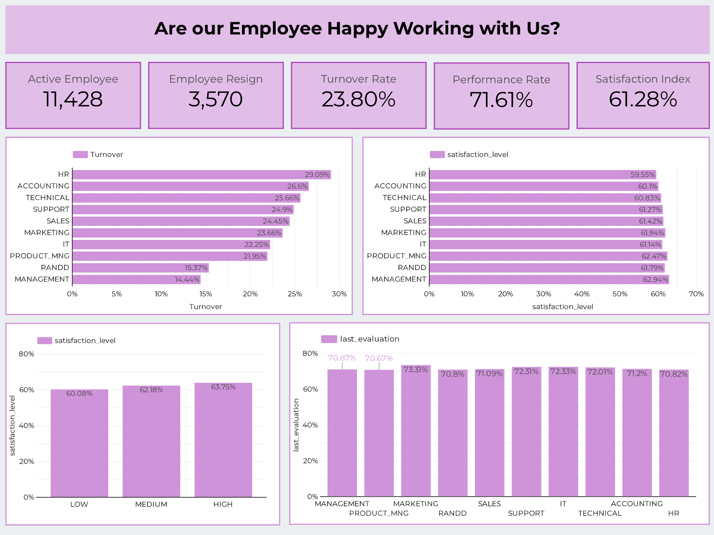

# HR Analytics Dashboard – Employee Satisfaction Using Looker Studio

## Overview
An HR Analytics dashboard built using **Looker Studio** to analyze employee satisfaction and HR performance metrics.  
This dashboard visualizes employee behavior, performance, and resignation patterns across departments.

## Key Metrics
- Active Employees
- Resigned Employees
- Turnover Rate
- Employee Satisfaction Score
- Average Final Evaluation Score

## Key Analysis
- Turnover comparison by department
- Satisfaction level comparison by department
- Satisfaction segmentation (Low / Medium / High)
- Performance evaluation score distribution by department

## Purpose & Insights
This dashboard helps HR teams to:
- identify departments with high turnover and low satisfaction
- detect early signs of employee disengagement
- support data-driven decision making for retention strategy
- monitor employee sentiment trends in a more visual and understandable way

## Tools & Tech Used
- Looker Studio
- Google Sheets (data source)
- Data cleaning & preprocessing

## Learnings
- Designing KPI-focused HR dashboards
- Segmenting satisfaction levels for people analytics
- Communicating HR insights visually for non-technical stakeholders

## Dashboard Preview

